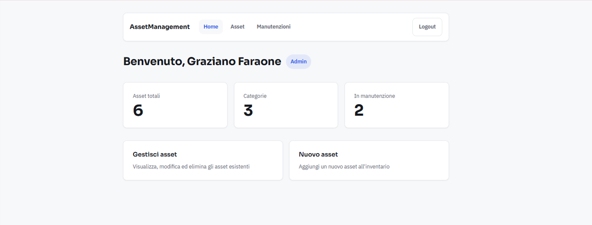
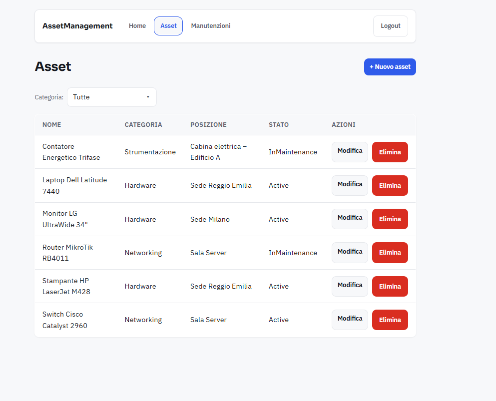
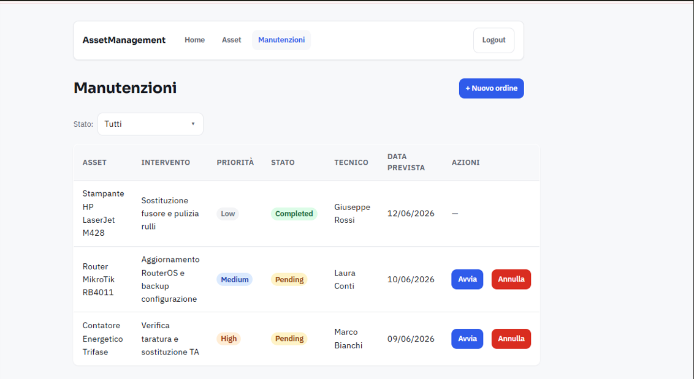

<div align="center">

# 🖥️ Asset Management — Web Client

**Single Page Application in Angular per la gestione di asset aziendali**

[](https://angular.dev)
[](https://www.typescriptlang.org)
[](https://sass-lang.com)
[](https://jwt.io)

[Funzionalità](#-funzionalità) • [Tech Stack](#️-tech-stack) • [Architettura](#-architettura) • [Avvio rapido](#-avvio-rapido)



</div>

---

## 📋 Panoramica

Client web della piattaforma **Asset Management**: una Single Page Application che consuma l'[API REST .NET](https://github.com/faragrazio/AssetManagement) per autenticare gli utenti e gestire l'inventario degli asset aziendali **e i relativi ordini di manutenzione** — CRUD, filtri, riepilogo e gestione del ciclo di vita degli interventi.

Il progetto è costruito con **Angular 21** in stile moderno: componenti **standalone**, stato reattivo con **signals** e nuovo control flow (`@if` / `@for`). L'obiettivo è una codebase piccola ma curata, con attenzione a esperienza utente (stati di caricamento, validazione, navigazione) e accessibilità di base.



---

## ✨ Funzionalità

- 🔐 **Autenticazione JWT** — login con token allegato automaticamente alle chiamate protette
- 📊 **Dashboard** — riepilogo con metriche calcolate (asset totali, categorie, in manutenzione)
- 📋 **Gestione asset (CRUD)** — elenco, creazione, modifica ed eliminazione
- 🗑️ **Eliminazione con conferma** — dialog custom al posto del `confirm()` nativo
- 🔎 **Filtro per categoria** — tendina custom, filtro lato client
- ✅ **Validazione form** — reactive form con messaggi di errore contestuali
- ⏳ **Skeleton screen** — segnaposto durante il caricamento, senza salti di layout
- 🔧 **Ordini di manutenzione** — ciclo di vita completo (Avvia → Completa / Annulla) con i pulsanti che rispettano la macchina a stati del backend; creare un ordine mette automaticamente l'asset in manutenzione



---

## 🛠️ Tech Stack

| Ambito | Tecnologia |
|---|---|
| Framework | Angular 21 (standalone, signals, nuovo control flow) |
| Linguaggio | TypeScript |
| Stili | SCSS con design token (`--color-*`, `--space-*`, `--radius-*`) |
| Form | Reactive Forms (`FormBuilder.nonNullable` + `Validators`) |
| Autenticazione | JWT via HTTP interceptor + functional guard |
| Routing | Lazy loading dei componenti (`loadComponent`) |
| Tipografia | Sora (titoli) + IBM Plex Sans (testo) |

---

## 🏗️ Architettura

Il codice è organizzato secondo una separazione **`core` / `features`**:

- **`core/`** — ciò che è trasversale e vive una volta sola nell'app: servizi HTTP, guard, interceptor e i modelli (contratti TypeScript condivisi).
- **`features/`** — le schermate, una cartella per funzionalità. Ogni schermata è un **componente standalone** caricato in **lazy loading** solo quando l'utente naviga su quella rotta.

```
src/app/
├── core/
│   ├── guards/            # authGuard — protegge le rotte riservate
│   ├── interceptors/      # authInterceptor — allega il JWT a ogni richiesta
│   ├── models/            # contratti TypeScript (Asset, Auth, MaintenanceOrder, ...)
│   └── services/          # AuthService, AssetService, MaintenanceOrderService
├── features/
│   ├── auth/              # login, register
│   ├── home/
│   ├── assets/            # asset-list, asset-create, asset-edit
│   └── maintenance/       # maintenance-list, maintenance-create
├── app.routes.ts          # rotte: lazy loadComponent + guard
└── app.config.ts          # provider globali (HttpClient + interceptor, router)
```

### Scelte architetturali

- **Componenti standalone** — niente `NgModule`: ogni componente dichiara da sé le proprie dipendenze (`imports`), in linea con la direzione attuale di Angular.
- **Stato reattivo con signals** — i dati delle schermate sono `signal`, i valori derivati (es. le metriche della dashboard, i filtri) sono `computed` che si ricalcolano da soli, senza `subscribe` manuali per lo stato della UI.
- **Lazy loading per rotta** — ogni schermata si carica con `loadComponent` solo al bisogno, alleggerendo il bundle iniziale.
- **Guardia funzionale** — `authGuard` (functional guard) blocca le rotte protette e reindirizza al login.
- **Interceptor JWT** — `authInterceptor`, registrato con `withInterceptors` in `app.config.ts`, allega il token a ogni chiamata in modo centralizzato: i service non se ne devono occupare.
- **Reactive Forms tipizzati** — `FormBuilder.nonNullable` per campi sempre valorizzati, con `Validators` per la validazione.
- **Macchina a stati lato UI** — per gli ordini di manutenzione l'interfaccia mostra solo le transizioni valide (Pending → InProgress → Completed / Cancelled), evitando richieste che il backend rifiuterebbe.
- **Design system a token** — colori, spaziature e raggi come CSS custom properties (`--color-*`, `--space-*`, `--radius-*`) in `styles.scss`, riusati ovunque.

---

## 🚀 Avvio rapido

### Prerequisiti
- **Node.js** ≥ 20 (LTS)
- Il **backend** in esecuzione → [Asset Management API](https://github.com/faragrazio/AssetManagement) (.NET 10): segui il suo README per l'avvio.

### 1. Avvia il backend
Il frontend si aspetta l'API su `https://localhost:7257`. Dalla cartella del backend:
```bash
dotnet run --project src/AssetManagement.API --launch-profile https
```
Swagger disponibile su `https://localhost:7257/swagger`.

### 2. Avvia il frontend
```bash
npm install
npm start
```
App su **http://localhost:4200** (ricarica automatica a ogni modifica).

### 3. Crea un account e accedi

Non esiste un utente predefinito: registra il tuo account dalla pagina `/register` del frontend o tramite Swagger, sull'endpoint `POST /api/auth/register`. Esempio di body:

```json
{
  "firstName": "Demo",
  "lastName": "User",
  "email": "demo@example.com",
  "password": "Password1",
  "role": "Admin"
}
```

Requisiti password: almeno **8 caratteri, una maiuscola e un numero**. Ruoli ammessi: `Admin`, `Technician`, `Viewer`.

Poi accedi dal frontend con l'email e la password appena create.

> L'URL dell'API è configurato in `src/environments/environment.ts` (campo `apiUrl`).